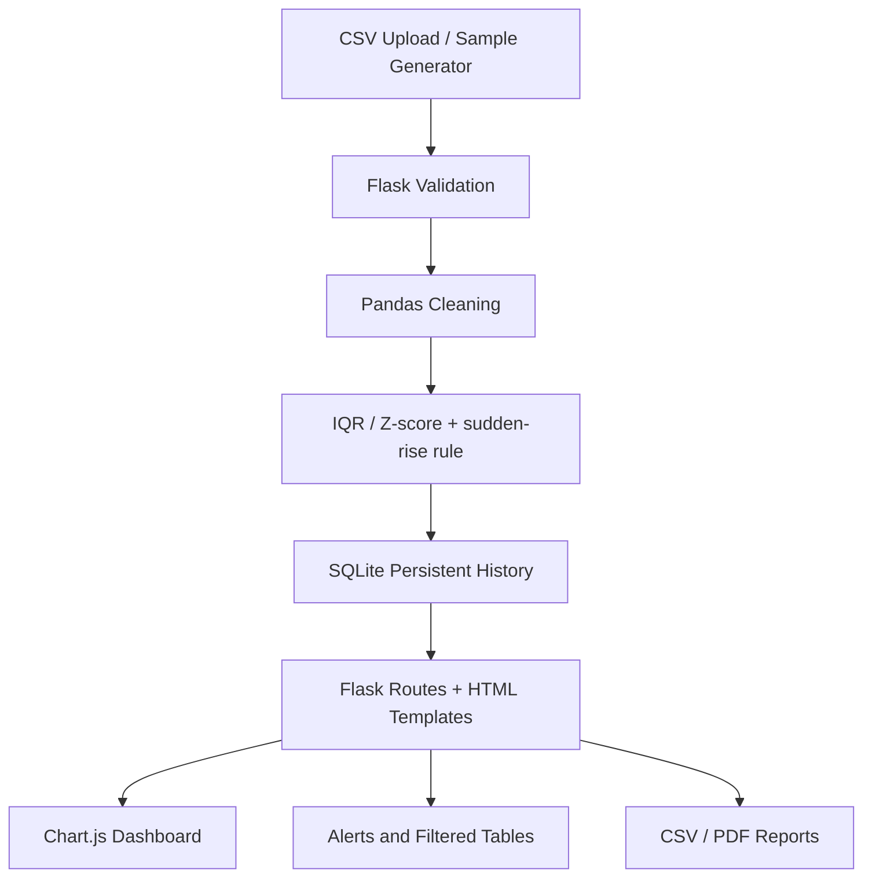

```mermaid
flowchart TD
A[CSV Upload / Sample Generator] --> B[Flask Validation]
B --> C[Pandas Cleaning]
C --> D[IQR / Z-score + sudden-rise rule]
D --> E[SQLite Persistent History]
E --> F[Flask Routes + HTML Templates]
F --> G[Chart.js Dashboard]
F --> H[Alerts and Filtered Tables]
F --> I[CSV / PDF Reports]
```
Local laptop deployment only. Not a deployed cloud cluster.
